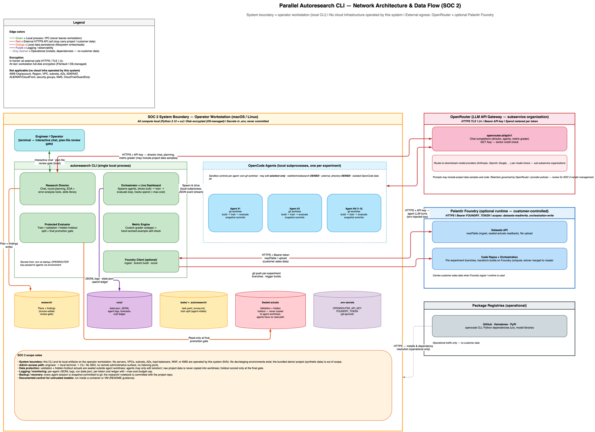

# Parallel Autoresearch CLI — SOC 2 Type 2 System Description Input
**Reporting period:** TBD — set centrally at consolidation
**Prepared:** 2026-08-21 · **Prepared from:** `Hyde-Inc/autoresearch@main@a360291eabc94f20996ce69a0e92f1f7d288cce6`
**Product owner:** `[NEEDS OWNER INPUT: name, role]` · **Review status:** DRAFT — NOT REVIEWED
**Scope note:** This document is a per-product input to the consolidated Section III system
description. It covers all nine DC 200 criteria. Sections 6 (DC5 controls), 7 (DC6 CUECs) and 9
(DC8 criteria not relevant) are **drafts requiring central compliance validation**. Section 5
(DC4 incidents) is an owner attestation pending confirmation against the central incident
register.

**A structural note for the consolidator:** unlike other Hyde products, Parallel Autoresearch is
a CLI that runs entirely on the operator's own workstation and operates no cloud infrastructure
of its own — this is asserted by the product's own audited network diagram (Figure 1), not
inferred by this pass. That single fact is why DC3 infrastructure and several DC5 CC6 rows below
are short or `N/A` rather than the 20+ rows typical of a hosted Hyde product: the shortness
reflects the system's actual shape, confirmed against the diagram, not shallow evidence
gathering. See the open items in §11 for what is still genuinely unresolved.

---

## 0. Completeness summary

| § | Criterion | Evidenced claims | Owner input needed | Central input needed | Status |
|---|---|---|---|---|---|
| 2 | DC1 Services | 6 | 0 | 0 | Derived |
| 3 | DC2 Commitments | 4 (system requirements only) | 1 (owner: any product-specific commitment) | 1 (whole commitments list absent) | NEEDS CENTRAL INPUT |
| 4 | DC3 Components | 24 | 3 | 1 | Derived |
| 5 | DC4 Incidents | — | 1 attestation | 1 confirm against register | NEEDS OWNER INPUT |
| 6 | DC5 TSC + controls | 10 draft rows | 0 | 10 validate + 5 (CC1–CC5) | DRAFT |
| 7 | DC6 CUECs | 6 draft rows | 0 | 6 validate | DRAFT |
| 8 | DC7 Subservice orgs | 1 confirmed, 3 candidates | 1 (retention posture) | 4 (confirm carve-out + candidates) | Derived |
| 9 | DC8 Not relevant | 1 draft row | 0 | 2 (category election, then agreement) | DRAFT |
| 10 | DC9 Changes | 2 candidates | 2 confirm significance | 0 | Derived + owner confirmation |

**Blocking items** — must be resolved before this document leaves the building:
1. Product owner name, role and sign-off (§ header, § 12).
2. DC4 incident attestation — not yet collected from the owner (§ 5).
3. DC2 commitments list — no MSA/SLA/DPA/security-policy source was found in the repository, so
   § 3.1 cannot be populated even provisionally (§ 3).
4. Confirmation of which optional TSC categories (Availability, Confidentiality, Processing
   Integrity, Privacy) are elected for this product, beyond the always-in-scope Security
   category — several DC5/DC8 rows below are contingent on this (§ 6, § 9).

**Contradictions found between the repositories and the network diagram:** none found. The
diagram's system-boundary and "not applicable" claims (no AWS org, VPC, ALB/WAF, KMS, CloudTrail
etc.) are consistent with the repository: no Terraform/CloudFormation, Helm charts, Dockerfiles,
or `.github/workflows` exist anywhere in the checked-out tree.

---

## 1. System boundary and architecture (DC1, DC3 context)

The system in scope is the **Parallel Autoresearch CLI** (package `parallel-autoresearch`,
console command `autoresearch`), a Python program the operator installs and runs on their own
workstation. The system boundary is the operator's workstation process tree — the CLI itself,
the OpenCode coding-agent subprocesses it spawns locally, and the local filesystem artifacts they
write. **This product operates no servers, cloud accounts, networks, or persistent hosted
infrastructure of any kind** `[EV: autoresearch-soc2-network-diagram.png, Legend — "Not
applicable (no cloud infra operated by this system): AWS Org/account, Region, VPC, subnets, AZs,
IGW/NAT, ALB/WAF/CloudFront, security groups, KMS, CloudTrail/GuardDuty"]`.



*Figure 1 — Parallel Autoresearch CLI network architecture and data flow. System boundary =
operator workstation (local CLI); external egress limited to OpenRouter and, optionally, the
customer's own Palantir Foundry tenant. `[EV: autoresearch-soc2-network-diagram.png]`*

**In scope:** the `autoresearch` CLI process and its local subprocesses (OpenCode coding agents,
one per experiment) running on the operator's workstation; local filesystem state under
`research/`, `runs/`, `tasks/`, `.autoresearch/`; outbound HTTPS calls to OpenRouter; outbound
HTTPS calls to the operator's own Palantir Foundry tenant when the optional Foundry runtime or
Foundry ingestion path is configured.

**Out of scope:** the bundled `demo/retail-demand-forecasting` sample project (synthetic data,
used only for demonstrations) `[EV: autoresearch/DEMO.md:1-16]`; any dev/staging environment —
none exists, because there is no environment beyond the operator's own machine; the internal
infrastructure and controls of OpenRouter, its downstream model providers, and the customer's own
Palantir Foundry tenant (carved out — see § 8); the operator's own workstation OS, disk
encryption and physical security (a complementary user-entity control — see § 7).

---

## 2. Types of services provided (DC1)

Parallel Autoresearch is a command-line tool that runs autonomous machine-learning research for
demand-forecasting problems. An operator points the CLI at a data-science project (their own
repository, or a plain sales-history CSV, or a Palantir Foundry dataset); in a streamed chat, the
tool's "Research Director" agrees a goal, a baseline model, and a scoring metric with the
operator `[EV: autoresearch/README.md:1-9, 143-152]`. The system then splits the project's
history into training, validation, and a sealed hidden holdout, and evaluates a baseline before
any research runs `[EV: autoresearch/README.md:14-16]`. For each research round, one or more
OpenCode coding-agent subprocesses — each confined to its own git worktree — draft, build,
locally train, and evaluate candidate models against a build → train → evaluate loop, while the
operator reviews and approves (or edits) each round's plan before it executes
`[EV: autoresearch/README.md:20-33, autoresearch/src/autoresearch/worker.py:64]`. Findings and the
best-performing valid model are written back into the operator's own project as durable,
git-committed Markdown and code artifacts `[EV: autoresearch/README.md:196-215]`.

The product optionally trains on Palantir Foundry compute instead of locally, when the operator
configures `runtime: foundry` and supplies their own Foundry credentials
`[EV: autoresearch/src/autoresearch/config.py:94-95, autoresearch/README.md:459-475]`.

No part of this system is a hosted, multi-tenant service: there are no customer accounts, no
sign-up flow, and no Hyde-operated production environment that customer traffic reaches. The
"service" is the software artifact itself, run by the operator on infrastructure the operator (or
their own cloud vendor of choice, e.g. their Palantir Foundry tenant) controls.

**Classes of user:**

| User class | Access method | Authentication |
|---|---|---|
| Engineer/Operator (the only user class this system has) | Local terminal — interactive chat and plan-file review gate, or non-interactive `run`/`resume` commands | None — a local process the operator already has shell access to; no login, session, or account system exists in this codebase `[EV: autoresearch-soc2-network-diagram.png; absence of any auth/session code under src/autoresearch/]` |

---

## 3. Principal service commitments and system requirements (DC2)

### 3.1 Service commitments — CONFIRM ONLY

`[NEEDS CENTRAL INPUT: commitments list not yet supplied]`. No MSA, SLA, DPA, or published
security/support policy for this product was found in the repository, and this skill's
instructions are explicit that a commitment must be sourced from such a document, never inferred
from code or README language. Nothing here should be read as a commitment until central compliance
supplies the list and the product owner confirms which apply.

| # | Commitment (central) | Applies to this product | Source document | Note |
|---|---|---|---|---|
| — | *(central commitments list not yet supplied)* | `[NEEDS CENTRAL INPUT]` | `[NEEDS CENTRAL INPUT]` | — |

### 3.2 System requirements

These are technical behaviors observed in the code that a future sourced commitment would likely
rely on. They are evidenced; which commitment (if any) each one supports is not, until § 3.1 is
populated.

| # | Requirement | Supports | Evidence |
|---|---|---|---|
| R1 | Model spend is capped per run (`--max-cost`), checked before each new research round begins | `[NEEDS OWNER INPUT: which commitment, if any]` | `[EV: autoresearch/README.md:355-368]` |
| R2 | Hidden holdout and validation actuals are never copied into any agent's workspace; agents see only the training split | `[NEEDS OWNER INPUT: which commitment, if any]` | `[EV: autoresearch/src/autoresearch/prepare.py:126, autoresearch/README.md:561-562]` |
| R3 | Each coding-agent session is snapshot-committed to git so an interrupted or timed-out session cannot lose in-flight work | `[NEEDS OWNER INPUT: which commitment, if any]` | `[EV: autoresearch/src/autoresearch/worker.py:219, 346]` |
| R4 | Secrets (`OPENROUTER_API_KEY`, `FOUNDRY_TOKEN`, `FOUNDRY_HOSTNAME`) are read from a local `.env` file that is excluded from version control | `[NEEDS OWNER INPUT: which commitment, if any]` | `[EV: autoresearch/.gitignore:1, autoresearch/src/autoresearch/config.py]` |

---

## 4. System components (DC3)

### 4.1 Infrastructure

| Component | Identifier / class | Configuration | Owns | Evidence |
|---|---|---|---|---|
| Cloud account / region / VPC / load balancer / KMS / CloudTrail / GuardDuty | **Not applicable** — none operated by this system | The system runs entirely on the operator's own workstation (macOS/Linux); there is no Hyde-operated cloud footprint for this product | product | `[EV: autoresearch-soc2-network-diagram.png, Legend]` |
| Operator workstation | Operator-owned macOS or Linux machine | Full-disk encryption is the operator's own OS-managed control (FileVault or equivalent) — not provided or enforced by this software | product | `[EV: autoresearch-soc2-network-diagram.png — "At rest: workstation full-disk encryption (FileVault / OS-managed)"]` |
| Palantir Foundry compute (optional, **customer-controlled**) | The operator's own Foundry tenant, `runtime: foundry` | Reached over HTTPS with the operator's own `FOUNDRY_TOKEN`; this is the customer's infrastructure, not Hyde's — see § 8 for why this is not treated as a subservice organization | subservice-candidate → reclassified as customer-controlled, see § 8 | `[EV: autoresearch/src/autoresearch/config.py:94-95, autoresearch/src/autoresearch/foundry.py:62]` |

### 4.2 Software

| Service / component | Language & framework | Runtime / version | Deployment unit | Evidence |
|---|---|---|---|---|
| `autoresearch` CLI | Python, Typer + Rich (terminal UI), Pydantic (config models) | Python `>=3.12,<3.15` | Installed as a `uv tool` or run from a repo checkout via `uv run`; packaged with Hatchling, console entry point `autoresearch.cli:app` | `[EV: autoresearch/pyproject.toml:6, 20-26]` |
| Model client | `openai` Python SDK `>=1.50`, pointed at OpenRouter's OpenAI-compatible endpoint | — | In-process library | `[EV: autoresearch/pyproject.toml:9, autoresearch/src/autoresearch/config.py:9 (DEFAULT_MODEL = "openrouter/moonshotai/kimi-k3")]` |
| OpenCode coding agent | External CLI tool (`opencode`), not part of this repository | A run artifact recorded OpenCode `1.1173.0` at the time it executed — a lead from a generated run file, not a pinned dependency version in `pyproject.toml` | Spawned as a local subprocess per experiment, one per agent | `[EV: autoresearch/src/autoresearch/opencode.py (shutil.which("opencode"), run_opencode); runs/foundry-demand-forecasting/20260810-181825/worktrees/eff6a32d/templateConfig.json:8]` — `[NEEDS OWNER INPUT: is a specific OpenCode version pinned/required for production use?]` |
| Environment/dependency management | `uv` | — | Operator-installed prerequisite | `[EV: autoresearch/README.md:47-51]` |
| Version control / worktree isolation | `git` | — | Operator-installed prerequisite; used to isolate each experiment in its own worktree and branch | `[EV: autoresearch/src/autoresearch/worker.py:239]` |
| Data/analysis libraries material to the service | `numpy`, `pandas`, `pyarrow` | `numpy>=2.0`, `pandas>=2.2`, `pyarrow>=17` | In-process libraries | `[EV: autoresearch/pyproject.toml:7-8, 12]` |

No CI/CD pipeline, container image, Helm chart, or Terraform/IaC exists in this repository
`[EV: absence — no `.github/workflows`, `Dockerfile`, `Chart.yaml`, or `*.tf` files were found in
the checked-out tree]`. This is consistent with a CLI tool that has no build-and-deploy pipeline
of its own, but central compliance should confirm there is genuinely no separate release/build
process (e.g. a private packaging pipeline) that this pass could not see.

### 4.3 People

| Role | Responsibilities | Access granted | Access mechanism | Evidence |
|---|---|---|---|---|
| Engineer/Operator (Hyde Engineer or customer, depending on who runs the CLI) | Installs and runs the CLI; sets the research goal, baseline and metric; reviews and approves (or edits/rejects) every round's research plan before execution | Whatever the operator's own machine, shell, and credentials already grant; no additional access is provisioned by this product | Local terminal session the operator already controls | `[EV: autoresearch-soc2-network-diagram.png — Engineer/Operator node; autoresearch/README.md:143-171]` |

**Exclusions, stated explicitly:** the product provisions no remote administrative surface, no
SSH access, and no listening network ports of its own `[EV: autoresearch-soc2-network-diagram.png
— SOC 2 scope notes: "Admin access path: engineer → local terminal → CLI. No SSH, no remote
administrative surface, no listening ports"]`. There are no other roles (no customer administrator
or end-user role) because this is a single-operator local tool, not a multi-tenant hosted service.

### 4.4 Procedures

- **Change management and deployment** — Each research experiment is built by a coding agent
  confined to its own git worktree and branch; the agent's edit permission is scoped to writing
  code (`edit: allow`), but `external_directory: deny` prevents it from touching anything outside
  its worktree, and it may only modify files under `solution/` per its operating instructions
  `[EV: autoresearch/src/autoresearch/ingest.py:346, 350; autoresearch/src/autoresearch/worker.py:64]`.
  Every session is snapshot-committed to git so a timeout or crash never loses a working state
  `[EV: autoresearch/src/autoresearch/worker.py:219, 346]`. On the optional Foundry runtime, the
  winning experiment's transform is merged and pushed to the project's `master` branch, which is
  how promotion ships the model `[EV: autoresearch/README.md:459-467]`. There is no CI/CD gate
  (no `.github/workflows` exist) — approval is the human plan-review gate described below, not an
  automated pipeline check.
- **Access provisioning and revocation** — `[NEEDS CENTRAL INPUT]`. This is a locally-run tool;
  there is no user-account or IAM system in this codebase to provision or revoke access to. Any
  organization-level control over who may install and run the CLI, or hold its API keys, sits
  outside this repository.
- **Backup and restore** — Every coding-agent session and every completed research round is
  committed to git, and the human-facing `research/` notebook is intended to be committed with the
  operator's own project repository `[EV: autoresearch/src/autoresearch/worker.py:165-174,
  autoresearch/README.md:196-215]`. There is no other backup mechanism (no database, no managed
  storage) because the system holds no state beyond the operator's own filesystem and git history.
- **Monitoring and alerting** — Each agent session streams a JSON event log to a per-attempt JSONL
  file, which drives the live terminal dashboard `[EV: autoresearch/src/autoresearch/opencode.py
  (run_opencode `on_event`/`log_path`), autoresearch/src/autoresearch/worker.py]`. This is local,
  client-side logging for the operator's own visibility during a run — it is not a centralized
  security-monitoring or alerting system, and central compliance should judge whether it is
  relevant evidence for any elected TSC criterion.
- **Incident detection and escalation** — `[NEEDS CENTRAL INPUT]`. No incident-response process,
  `SECURITY.md`, or escalation path was found in the repository.
- **Key and secret management** — `OPENROUTER_API_KEY`, and optionally `FOUNDRY_HOSTNAME` /
  `FOUNDRY_TOKEN`, are read from a local `.env` file at startup; `.env` is listed in `.gitignore`
  and is therefore never committed `[EV: autoresearch/.gitignore:1, autoresearch/.env.example:1,
  autoresearch/src/autoresearch/foundry.py:62-65]`. `autoresearch doctor` validates that the
  OpenRouter key is present and live (with a `--no-api` flag to skip the live check) and reports
  whether Foundry credentials are configured, without ever printing secret values
  `[EV: autoresearch/src/autoresearch/doctor.py:1-9; README.md:81-92]`. A distinct `JOB_TOKEN`
  secret name appears only inside a Foundry-side CI template generated into a past run's working
  tree (`runs/foundry-demand-forecasting/.../ci.yml`), not in this repository's own configuration
  — `[NEEDS OWNER INPUT: confirm JOB_TOKEN belongs to the customer's Foundry pipeline and is out of
  this product's control, not something this product issues or manages]`
  `[EV: autoresearch/runs/foundry-demand-forecasting/20260810-181825/worktrees/eff6a32d/ci.yml:109-112]`.
- **Vulnerability management** — `[NEEDS CENTRAL INPUT]`. No dependency-scanning, SAST, or
  container-scanning configuration exists in this repository (no `.github/workflows`, `Dockerfile`,
  or equivalent were found).

### 4.5 Data

| Data type | Classification | Where stored | Encryption at rest | Retention | Evidence |
|---|---|---|---|---|---|
| Project source code and model code the operator points the CLI at | Confidential — the customer's own IP | Operator's local filesystem (the project directory itself, plus a copy under the tool's protected `seed/` workspace) | Operator's own workstation disk encryption (not provided by this product) | `[NEEDS OWNER INPUT]` | `[EV: autoresearch/src/autoresearch/prepare.py:59-75 (_copy_project_code)]` |
| Customer sales / demand-forecasting history (`date`, `sku_name`, `sales`, `selling_price` schema) | Confidential | Operator's local filesystem under `tasks/<name>/`, or the customer's own Palantir Foundry tenant when that path is used | Operator's own workstation disk encryption, or the customer's own Foundry tenant's controls | `[NEEDS OWNER INPUT]` | `[EV: autoresearch/README.md:196-225]` |
| Sealed validation and hidden-holdout actuals (subset of the above) | Confidential — access-restricted by design | `private/validation.parquet`, `private/holdout.parquet` on the operator's local filesystem; never copied into any agent worktree | Operator's own workstation disk encryption | Held for the life of the research session; deletion behavior `[NEEDS OWNER INPUT]` | `[EV: autoresearch/src/autoresearch/prepare.py:126, autoresearch/src/autoresearch/foundry_setup.py:10-11]` |
| Customer prompts and completions / agent trajectories sent to OpenRouter (may include project data samples) | Confidential, may include customer content | Not stored by this product beyond the local JSONL agent logs; upstream retention is OpenRouter's / the model provider's | Not stored beyond local logs at rest | Governed by OpenRouter / model-provider policy — `[NEEDS OWNER INPUT: source document]` | `[EV: autoresearch-soc2-network-diagram.png — "may include project data samples", autoresearch/src/autoresearch/opencode.py]` |
| Credentials and secrets (`OPENROUTER_API_KEY`, `FOUNDRY_TOKEN`, `FOUNDRY_HOSTNAME`) | Restricted — names documented, values never | Local `.env` file, git-ignored | Operator's own workstation disk encryption | Held until rotated by the operator | `[EV: autoresearch/.gitignore:1, autoresearch/.env.example:1]` |
| Model artifacts produced during research (e.g. `solution/train.py` and its trained model files) | Internal — no customer PII | Operator's local filesystem under `runs/` | Operator's own workstation disk encryption | `[NEEDS OWNER INPUT]` | `[EV: autoresearch/src/autoresearch/worker.py:80]` |
| Bundled demo/synthetic dataset | Public / non-sensitive | Repository (`demo/retail-demand-forecasting/`) | N/A | N/A | `[EV: autoresearch/DEMO.md:1-16]` |

**Data flow narrative:** the operator points the CLI at their own project (a local repo, a CSV, or
a Foundry dataset). The tool copies the project's code into a protected local workspace and splits
its history into train / validation / hidden-holdout locally, sealing the latter two away from
every coding agent `[EV: prepare.py]`. During research, the Director and each coding agent send
chat, planning, and code content to OpenRouter over HTTPS with an API key — this traffic may
include samples of the operator's project data `[EV: diagram]`. If the optional Foundry runtime or
Foundry ingestion path is configured, sales data, forecast requests, and forecasts are exchanged
with the operator's own Palantir Foundry tenant over HTTPS with a bearer token that belongs to the
operator, not to Hyde `[EV: foundry.py:62, 140, 396]`. All other artifacts (plans, findings, run
state, logs, model code) are written only to the operator's own local filesystem and, where the
operator chooses to `git commit`, to their own project's git history. Nothing is transmitted to,
or stored on, infrastructure Hyde operates for this product, because none exists.

**Data the system does not handle:** the system does not process payment card data, health
records, or biometric data. It has no built-in multi-tenant customer database and does not itself
retain customer sales data beyond the operator's own local filesystem or the operator's own
Foundry tenant.

---

## 5. System incidents (DC4) — OWNER ATTESTATION

`[NEEDS OWNER INPUT: confirm incidents, or confirm none]`

No repository can answer this. Pending the product owner's response, the placeholder statement
is: *"The product owner is not aware of any incident that resulted in a significant failure to
meet service commitments or system requirements. Scoping to the reporting period and confirmation
against the central incident register are pending."*

| Date | Nature of incident | Commitment affected | Extent / effect | Disposition |
|---|---|---|---|---|
| `[NEEDS OWNER INPUT]` | `[NEEDS OWNER INPUT]` | `[NEEDS OWNER INPUT]` | `[NEEDS OWNER INPUT]` | `[NEEDS OWNER INPUT]` |

---

## 6. Trust services criteria and related controls (DC5) — DRAFT, CENTRAL COMPLIANCE TO VALIDATE

> Every row below is a **draft mapping derived from repository evidence**. Central compliance must
> accept or strike each one. Because this product operates no cloud infrastructure, several
> controls that would normally be platform-level (SSO/MFA, network segmentation, KMS) are simply
> not applicable here rather than missing — see § 9 for the corresponding "not relevant" claims.

**Categories in scope:** Security (CC) — always in scope. `[NEEDS CENTRAL INPUT: confirm elected
categories — Availability / Confidentiality / Processing Integrity / Privacy]`. All rows below are
Security-series and are drafted without waiting on that confirmation; any Availability,
Confidentiality, Processing Integrity, or Privacy rows are deferred until the election is known.

| Control ID | TSC | Control (what it does) | Owns | Evidence | Validation |
|---|---|---|---|---|---|
| `CC6.1-AGENT-EDIT-SCOPE` | CC6.1 | Each OpenCode coding-agent session is confined to its own git worktree; its OpenCode permission config sets `external_directory: deny`, and its operating instructions restrict writes to `solution/` | product | `[EV: autoresearch/src/autoresearch/ingest.py:346, 350; autoresearch/src/autoresearch/worker.py:64, 239]` | Draft |
| `CC6.1-AGENT-EGRESS-DENY` | CC6.1 | Coding-agent sessions have `webfetch: deny` and `websearch: deny` set in their OpenCode permission config, blocking agent-initiated outbound web access | product | `[EV: autoresearch/src/autoresearch/ingest.py:353-354]` | Draft |
| `CC6.1-HOLDOUT-SEGREGATION` | CC6.1 | Validation and hidden-holdout actuals are written to a private location and are never copied into the seed workspace or any agent worktree; agents only ever see the training split | product | `[EV: autoresearch/src/autoresearch/prepare.py:126, autoresearch/README.md:561-562]` | Draft |
| `CC6.1-ENV-SECRETS` | CC6.1 | API credentials (`OPENROUTER_API_KEY`, `FOUNDRY_TOKEN`, `FOUNDRY_HOSTNAME`) are supplied via a local `.env` file that is excluded from version control | product | `[EV: autoresearch/.gitignore:1, autoresearch/.env.example:1]` | Draft |
| `CC6.7-TLS-EXTERNAL` | CC6.7 | All external API calls (to OpenRouter and, optionally, the operator's Palantir Foundry tenant) are made over HTTPS | product | `[EV: autoresearch-soc2-network-diagram.png; autoresearch/src/autoresearch/foundry.py:131, 140]` | Draft |
| `CC7.2-AGENT-EVENT-LOG` | CC7.2 | Each agent session's tool calls and phases are streamed and appended to a per-attempt JSONL log used by the live dashboard | product | `[EV: autoresearch/src/autoresearch/opencode.py (run_opencode); autoresearch/src/autoresearch/worker.py]` | Draft — central to judge relevance; this is local/client-side operational logging, not centralized security monitoring |
| `CC8.1-WORKTREE-ISOLATION` | CC8.1 | Each experiment runs in its own git worktree/branch; the worker snapshot-commits the agent's `solution/` state after every session so an interrupted session cannot lose or corrupt in-flight work | product | `[EV: autoresearch/src/autoresearch/worker.py:165-174, 219, 239, 346]` | Draft |
| `CC8.1-PLAN-REVIEW-GATE` | CC8.1 | Each research round's plan is written to an editable Markdown file and requires an explicit operator `execute` before the coding agents run against it | product | `[EV: autoresearch/README.md:143-171]` | Draft — **note:** the non-interactive `autoresearch run` command explicitly skips this review gate (`[EV: autoresearch/README.md:419-420 — "Start a new non-interactive research run ... (no review gate)"]`); central should confirm whether that path is in scope and, if so, what compensates for the missing gate |
| `CC9.2-VENDOR-DEPENDENCY` | CC9.2 | The system depends on OpenRouter for all LLM inference and, optionally, the operator's own Palantir Foundry tenant; no vendor-risk-assessment process for either was found in this repository | product | `[EV: autoresearch/pyproject.toml:9, autoresearch/src/autoresearch/config.py:9]` | Draft — central input needed on whether/how OpenRouter is formally reviewed as a subservice organization |
| `A1.2-GIT-SNAPSHOT` | A1.2 | Each agent session and completed research round is committed to git as a durable local snapshot, and the human-facing notebook is intended to be committed to the operator's own repository | product | `[EV: autoresearch/src/autoresearch/worker.py:165-174, autoresearch/README.md:196-215]` | Draft — contingent on Availability being an elected category; if not elected, strike this row |

**Criteria with no repository evidence** — these are organisational and belong to central
compliance; do not stretch a technical control to cover them:

| TSC | Why no repo evidence | Owner |
|---|---|---|
| CC1.x | Control environment, board oversight, org structure | `[NEEDS CENTRAL INPUT]` |
| CC2.x | Communication of policies | `[NEEDS CENTRAL INPUT]` |
| CC3.x | Risk assessment process | `[NEEDS CENTRAL INPUT]` |
| CC4.x | Monitoring of controls | `[NEEDS CENTRAL INPUT]` |
| CC5.x | Selection and development of controls | `[NEEDS CENTRAL INPUT]` |

---

## 7. Complementary user entity controls (DC6) — DRAFT, CENTRAL COMPLIANCE TO VALIDATE

Controls the **operator/customer** must operate for this system's controls to work as intended.
Drafted conservatively — a CUEC listed but not genuinely required weakens the report.

| # | Control the customer must operate | Why it matters | Validation |
|---|---|---|---|
| U1 | Safeguard `OPENROUTER_API_KEY` and, if used, `FOUNDRY_TOKEN` / `FOUNDRY_HOSTNAME`; never commit them to version control | The product reads these from a local `.env` file and enforces no server-side rotation or scoping of its own | Draft |
| U2 | Secure the workstation the CLI runs on: disk encryption, OS patching, physical access | The system boundary is the operator's own workstation; this product provides no compensating control at that layer | Draft |
| U3 | Actually review each round's research plan before typing `execute`, rather than approving reflexively; if using the non-interactive `run` path, apply an equivalent review outside the tool | The plan-review gate (`CC8.1-PLAN-REVIEW-GATE`) is the primary control against unwanted agent actions, and it depends entirely on the human using it | Draft |
| U4 | Run the CLI inside a container or VM when evaluating untrusted models | The README states the default configuration "is suitable for a trusted local demo. Use a container or VM for untrusted models" `[EV: autoresearch/README.md:563-564]` | Draft |
| U5 | When using the optional Palantir Foundry integration, provision and safeguard the operator's own Foundry token with least-privilege scopes, and operate that tenant's own controls | Foundry, when used, is the customer's own infrastructure (see § 8) — its controls are the customer's responsibility, not carved out to Hyde | Draft |
| U6 | Decide what project data and code is exposed to the CLI, understanding that it may be included in prompts sent to OpenRouter | The diagram documents that HTTPS calls to OpenRouter "may include project data samples" `[EV: autoresearch-soc2-network-diagram.png]` | Draft |

---

## 8. Subservice organizations (DC7)

| Vendor | Service performed | Data received / transmitted | Retention | Method | Evidence |
|---|---|---|---|---|---|
| OpenRouter | LLM API gateway — chat completions for the Research Director, coding agents, and the metric grader; routes to downstream model providers by model choice | Chat/planning content, code, and possibly project data samples (agent trajectories, prompts and completions) | `[NEEDS OWNER INPUT: retention posture / source document for this commitment]` | Carve-out | `[EV: autoresearch-soc2-network-diagram.png, autoresearch/pyproject.toml:9, autoresearch/src/autoresearch/config.py:9, autoresearch/.env.example:1]` |

**Sub-subservice organizations:** OpenRouter routes to downstream model providers selected by the
operator's model configuration — the diagram names Anthropic, OpenAI, and Google as examples.
These are listed here as sub-subservice organizations under OpenRouter, per the diagram, rather
than promoted to top-level rows `[EV: autoresearch-soc2-network-diagram.png]`.

**Reliance statement:** The system relies on the controls of OpenRouter (and, transitively, the
model providers it routes to). Their controls are not included in the scope of this description
(carve-out method).

**Candidates identified but not confirmed as subservice organizations:**

| Candidate | Where it appeared | Why it may not qualify |
|---|---|---|
| Palantir Foundry | `config.py` (`runtime: foundry`), `foundry.py`, `foundry_setup.py`, README §"Train on Palantir Foundry" | The diagram explicitly labels this integration **customer-controlled**: the CLI reaches the *operator's own* Foundry tenant using the *operator's own* `FOUNDRY_TOKEN`, not a Hyde-held credential or Hyde-operated Foundry account. Per the canonical distinction between subservice organizations and customer-controlled data/compute sources, this looks like the latter — but it is unusual in also being used as a compute *runtime*, not just a data source, so central should confirm the boundary explicitly with the auditor `[EV: autoresearch-soc2-network-diagram.png; autoresearch/src/autoresearch/foundry.py:62]` |
| OpenCode | `opencode.py`, `worker.py`, README throughout | This is a third-party CLI the operator installs (e.g. via Homebrew) and runs entirely as a local subprocess on their own workstation. Per the self-hosted-software rule, running someone else's software yourself is a DC3 software component, not a subservice organization — there is no OpenCode-operated service in this data flow | `[EV: autoresearch/src/autoresearch/opencode.py (shutil.which("opencode"))]` |
| GitHub, Homebrew, PyPI (package registries) | Implied by `pyproject.toml`/`uv.lock` and the README's install instructions; also shown on the diagram as "Package Registries (operational)" | The diagram itself labels this traffic "operational only — no customer data"; no customer data is received or transmitted, so it does not meet DC7's threshold, though central may still want it recorded for completeness | `[EV: autoresearch-soc2-network-diagram.png; autoresearch/pyproject.toml, autoresearch/uv.lock]` |

---

## 9. Criteria not relevant (DC8) — DRAFT, CENTRAL COMPLIANCE TO VALIDATE

| TSC | Why it may not be relevant | What carries it instead | Validation |
|---|---|---|---|
| CC6.4 (physical and environmental access to production infrastructure) | This product operates no data center, office facility, or cloud account of its own; all compute is either the operator's own workstation or the facilities of the vendors described in § 8 | Subservice organization (OpenRouter, and transitively its downstream providers) for the vendor leg; the operator's own physical/workstation security (a CUEC, § 7) for the local leg | Draft — auditor must agree |

Beyond CC6.4, most other criteria a hosted product would need to address as "not relevant"
(network-segmentation criteria, availability of a production environment, etc.) instead show up
above in § 6 or § 8 as genuinely not applicable rather than as elected-but-inapplicable — that
distinction, and which optional categories (Availability, Confidentiality, Processing Integrity,
Privacy) are even elected for this product, needs central compliance's confirmation before this
section can be considered complete `[NEEDS CENTRAL INPUT: confirm elected categories, then which
criteria within them are not relevant]`.

---

## 10. Significant changes (DC9)

**Change candidates, last 12 months — not yet scoped to the reporting period.**
Consolidation filters these to the audit window. Candidates come from merge commits and tags;
window scanned: since 2025-08-21 (12 months before this pass).

| Date | Change | Effect on the system or its controls | Evidence |
|---|---|---|---|
| 2026-08-10 | Merge PR #4: Foundry integration — added the optional Palantir Foundry ingestion and compute runtime (`runtime: foundry`), a new external data/compute dependency | Introduces a new customer-controlled external integration and a new credential (`FOUNDRY_TOKEN`) surface; candidate for DC3/DC7 significance | `[EV: git merge commit, autoresearch@main, "Merge pull request #4 from Hyde-Inc/sk/foundry-integration"]` |
| 2026-08-09 | Merge PR #2: interactive setup and forecasting director skills — added the interactive chat-based setup flow and the eight forecasting playbooks the Research Director cites | Changes the primary user-facing control (the plan-review gate) and adds the skills library that shapes what agents are instructed to do | `[EV: git merge commit, autoresearch@main, "Merge PR #2: interactive setup and forecasting director skills"]` |

Tag observed: `v0.1.0` (creation date not distinguishable from tag list alone)
`[EV: git tag --sort=-creatordate, autoresearch@main]`.

The repository has 4 contributors and its earliest reachable history is recent relative to this
pass — `[NEEDS OWNER INPUT: confirm whether this repository's full history is captured here, or
whether an earlier history exists elsewhere]`. The owner must rule on whether either candidate
above is a significant change for DC9 purposes; do not treat their presence here as a
predetermined "yes."

---

## 11. Open items

| # | Question | Section | Owner | Blocking? |
|---|---|---|---|---|
| 1 | Product owner name, role, and sign-off | Header, § 12 | product-owner | Yes |
| 2 | Confirm incidents in the period, or confirm none, against the central incident register | § 5 | product-owner + central | Yes |
| 3 | Supply the commitments list (MSA/SLA/DPA/published policy) so § 3.1 can be populated | § 3 | central | Yes |
| 4 | Confirm which optional TSC categories (Availability, Confidentiality, Processing Integrity, Privacy) are elected for this product | § 6, § 9 | central | Yes |
| 5 | Confirm the boundary treatment of Palantir Foundry as customer-controlled rather than a Hyde subservice organization, including when it is used as a compute runtime rather than just a data source | § 8 | central | No |
| 6 | Source a retention posture for data OpenRouter/model providers receive | § 4.5, § 8 | product-owner | No |
| 7 | Confirm whether a pinned/supported OpenCode version exists for production use, beyond the version observed in a generated run artifact | § 4.2 | product-owner | No |
| 8 | Confirm `JOB_TOKEN` (found only inside a Foundry-generated CI template under `runs/`) is the customer's own Foundry pipeline credential and out of this product's control | § 4.4 | product-owner | No |
| 9 | Rule on the significance of the two DC9 candidates (Foundry integration; interactive setup + skills library) | § 10 | product-owner | No |
| 10 | Confirm data-retention and deletion behavior for local artifacts under `runs/`, `research/`, `tasks/`, and the sealed `private/` split files | § 4.5 | product-owner | No |
| 11 | Confirm whether the non-interactive `autoresearch run` path (which skips the plan-review gate) is in scope for this description, and what compensates for the missing gate on that path | § 6 | product-owner + central | No |
| 12 | Confirm access-provisioning, incident-response, and vulnerability-management processes that may exist outside this repository (e.g. at an organizational level) even though none were found in-repo | § 4.4 | central | No |

---

## 12. Reviewer checklist

- [ ] Every claim in sections 2–10 is either evidenced or resolved — no `[NEEDS OWNER INPUT]` remains
- [ ] Every service commitment traces to a named source document, not to inference
- [ ] No claim contradicts the network diagram (encryption, boundaries, egress, data flow)
- [ ] Every third-party dependency that receives or transmits data appears in section 8
- [ ] **Every control in section 6 is one that actually operates today** — struck if not
- [ ] Section 6 control mappings reviewed and signed off by central compliance
- [ ] Section 9 "not relevant" claims agreed with the auditor, not just asserted
- [ ] Section 5 incidents confirmed against the central incident register
- [ ] No marketing language — no "industry-leading", "enterprise-grade", "bank-level"
- [ ] No secret values, key material, credentials, customer names or personal data anywhere
- [ ] Infrastructure identifiers, versions and settings match the current state of `main`
- [ ] Retention and deletion statements match what the system actually does
- [ ] Explicit negatives are true and sourced
- [ ] Roles in 4.3 reflect current team structure and access
- [ ] Sections 5 and 10 list everything from the last 12 months — filtering to the reporting period happens centrally, so err on the side of including
- [ ] Product owner name and sign-off date recorded below

**Product owner sign-off:** ______________________  **Date:** ____________
**Reviewer:** ______________________  **Date:** ____________

---

## Appendix A — Merge data (do not edit by hand)

```yaml
product: autoresearch
display_name: Parallel Autoresearch CLI
owner_role: Product Owner
period: TBD                       # set centrally at consolidation
changes_collected_since: 2025-08-21
sources:
  - {repo: autoresearch, url: "git@github.com:Hyde-Inc/autoresearch.git", branch: main, commit: a360291eabc94f20996ce69a0e92f1f7d288cce6}
diagram: autoresearch-soc2-network-diagram.png
aws_accounts: []              # N/A — no cloud infrastructure operated by this system
regions: []                   # N/A — see diagram legend
handles_customer_data: true   # customer project code, sales history, and prompts/trajectories may be handled

internal_dependencies: []      # none found — no calls to other Hyde-internal services identified

subservice_orgs:
  - name: OpenRouter
    service: LLM API gateway (chat completions; routes to downstream model providers)
    data: [Customer prompts and completions, Agent trajectories and execution traces]
    retention: UNKNOWN
    method: carve-out
    sub_subservice: [Anthropic, OpenAI, "Google (Gemini)"]
    evidence: ["autoresearch/pyproject.toml:9", "autoresearch/src/autoresearch/config.py:9", "autoresearch/.env.example:1"]

customer_controlled_systems:
  - {name: "Palantir Foundry (operator's own tenant)", auth: "Bearer FOUNDRY_TOKEN", data: "Customer sales / DSR data"}

datastores: []                 # no managed/hosted datastore — all state is local filesystem + git

data_types:
  - {label: "Customer sales / DSR data", classification: Confidential, retention: UNKNOWN}
  - {label: "Customer prompts and completions", classification: "Confidential, may include customer content", retention: UNKNOWN}
  - {label: "Agent trajectories and execution traces", classification: "Confidential, may include customer content", retention: UNKNOWN}
  - {label: "Credentials and secrets", classification: Restricted, retention: "until rotated by operator"}
  - {label: "Model weights and artifacts", classification: Internal, retention: UNKNOWN}
  - {label: "Synthetic or demo data", classification: "Public / non-sensitive", retention: N/A}

roles:
  - {role: "Hyde Engineer", access: "Same as Product Owner below — this product has one user class", mechanism: "Local terminal, no additional provisioning"}
  - {role: "Product Owner", access: "Runs the CLI; approves research plans", mechanism: "Local terminal"}

controls:
  - {id: CC6.1-AGENT-EDIT-SCOPE, tsc: CC6.1, statement: "Coding agents confined to their own git worktree; external_directory: deny; writes restricted to solution/", ownership: product, evidence: ["autoresearch/src/autoresearch/ingest.py:346", "autoresearch/src/autoresearch/ingest.py:350", "autoresearch/src/autoresearch/worker.py:64"], validation: draft}
  - {id: CC6.1-AGENT-EGRESS-DENY, tsc: CC6.1, statement: "webfetch: deny and websearch: deny in agent permission config", ownership: product, evidence: ["autoresearch/src/autoresearch/ingest.py:353", "autoresearch/src/autoresearch/ingest.py:354"], validation: draft}
  - {id: CC6.1-HOLDOUT-SEGREGATION, tsc: CC6.1, statement: "Validation/holdout actuals sealed from agent worktrees", ownership: product, evidence: ["autoresearch/src/autoresearch/prepare.py:126"], validation: draft}
  - {id: CC6.1-ENV-SECRETS, tsc: CC6.1, statement: "Secrets read from local .env, excluded from version control", ownership: product, evidence: ["autoresearch/.gitignore:1"], validation: draft}
  - {id: CC6.7-TLS-EXTERNAL, tsc: CC6.7, statement: "All external API calls over HTTPS", ownership: product, evidence: ["autoresearch/src/autoresearch/foundry.py:131"], validation: draft}
  - {id: CC7.2-AGENT-EVENT-LOG, tsc: CC7.2, statement: "Per-attempt JSONL event log of agent actions", ownership: product, evidence: ["autoresearch/src/autoresearch/opencode.py"], validation: draft}
  - {id: CC8.1-WORKTREE-ISOLATION, tsc: CC8.1, statement: "Per-experiment git worktree with snapshot commits each session", ownership: product, evidence: ["autoresearch/src/autoresearch/worker.py:239", "autoresearch/src/autoresearch/worker.py:346"], validation: draft}
  - {id: CC8.1-PLAN-REVIEW-GATE, tsc: CC8.1, statement: "Human review/execute gate before a round's agents run (interactive path only)", ownership: product, evidence: ["autoresearch/README.md:143"], validation: draft}
  - {id: CC9.2-VENDOR-DEPENDENCY, tsc: CC9.2, statement: "Dependency on OpenRouter and optional Foundry with no in-repo vendor review process", ownership: product, evidence: ["autoresearch/pyproject.toml:9"], validation: draft}
  - {id: A1.2-GIT-SNAPSHOT, tsc: A1.2, statement: "Git snapshot commit per session/round as durable local backup", ownership: product, evidence: ["autoresearch/src/autoresearch/worker.py:165"], validation: draft}

cuecs:
  - {id: U1, statement: "Safeguard OPENROUTER_API_KEY / FOUNDRY_TOKEN / FOUNDRY_HOSTNAME; never commit them", validation: draft}
  - {id: U2, statement: "Secure the workstation (disk encryption, patching, physical access)", validation: draft}
  - {id: U3, statement: "Actually review each round's plan before executing", validation: draft}
  - {id: U4, statement: "Run in a container or VM for untrusted models", validation: draft}
  - {id: U5, statement: "Provision and safeguard own Foundry token/scopes when Foundry runtime is used", validation: draft}
  - {id: U6, statement: "Control what project data/code is exposed to the CLI and, via prompts, to OpenRouter", validation: draft}

commitments: []                 # none sourced yet — whole list pending central compliance

not_relevant:
  - {tsc: CC6.4, reason: "No data center, office, or cloud account operated by this system", validation: draft}

incidents: []                   # pending owner attestation, see § 5

significant_changes:
  - {date: "2026-08-10", change: "Merge PR #4 — Palantir Foundry integration (optional ingest + compute runtime)", effect: "New external data/compute dependency and credential surface", evidence: ["autoresearch@main merge commit: Merge pull request #4 from Hyde-Inc/sk/foundry-integration"]}
  - {date: "2026-08-09", change: "Merge PR #2 — interactive setup and forecasting director skills", effect: "New primary user-facing control (plan-review gate) and skills library", evidence: ["autoresearch@main merge commit: Merge PR #2: interactive setup and forecasting director skills"]}

open_items:
  - {id: 1, question: "Product owner name, role, sign-off", section: 12, owner: product-owner, blocking: true}
  - {id: 2, question: "Confirm incidents or confirm none, against central register", section: 5, owner: product-owner, blocking: true}
  - {id: 3, question: "Supply commitments list (MSA/SLA/DPA/policy)", section: 3, owner: central, blocking: true}
  - {id: 4, question: "Confirm elected optional TSC categories beyond Security", section: 6, owner: central, blocking: true}
  - {id: 5, question: "Confirm Palantir Foundry boundary treatment (customer-controlled vs subservice)", section: 8, owner: central, blocking: false}
  - {id: 6, question: "Source retention posture for OpenRouter/model-provider data handling", section: 8, owner: product-owner, blocking: false}
  - {id: 7, question: "Confirm pinned/supported OpenCode version for production use", section: 4, owner: product-owner, blocking: false}
  - {id: 8, question: "Confirm JOB_TOKEN ownership (customer's Foundry pipeline, out of product control)", section: 4, owner: product-owner, blocking: false}
  - {id: 9, question: "Rule on DC9 candidate significance", section: 10, owner: product-owner, blocking: false}
  - {id: 10, question: "Confirm retention/deletion for local run artifacts", section: 4, owner: product-owner, blocking: false}
  - {id: 11, question: "Confirm whether non-interactive run path (no review gate) is in scope, and its compensating control", section: 6, owner: product-owner, blocking: false}
  - {id: 12, question: "Confirm org-level access/incident/vulnerability processes that may exist outside this repo", section: 4, owner: central, blocking: false}

contradictions: []               # none found between repository and network diagram

counts:
  evidenced_claims: 48
  open_owner: 9
  open_central: 6
  blocking: 4
```
